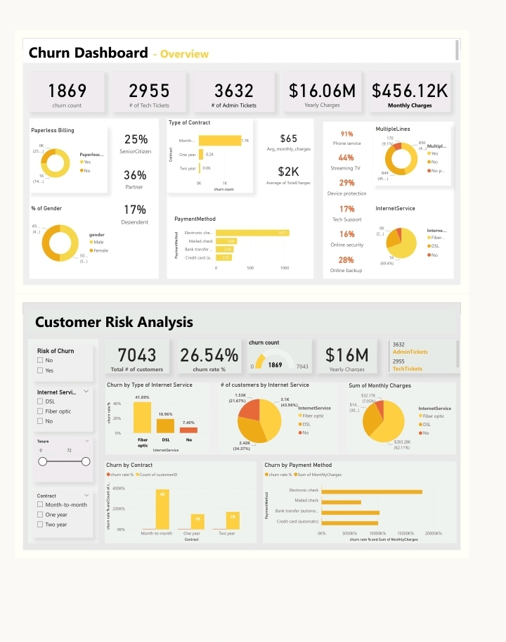

 

# Customer Churn Retention Analytics

## Table of Contents
- [Project Overview](#project-overview)
- [Data Sources](#data-sources)
- [Tools](#tools)
- [Data Preparation/Cleaning](#data-preparationcleaning)
- [Exploratory Data Analysis](#exploratory-data-analysis)
- [Data Analysis](#data-analysis)
- [Results/Findings](#resultsfindings)
- [Recommendations](#recommendations)

## Project Overview
- Define proper KPI's
- Create a dashboard for the retention manager reflecting the KPI's
- Write a short email to him (the engagement partner) explaining your findings, and include suggestions as to what needs to be changed

## Data Sources
Data was provided by pwc 

## Tools
- Power BI

## Data Preparation/Cleaning

- Handling missing values
- Removing duplicates
- Data transformation or normalization

## Exploratory Data Analysis
- Customers who left within the last month
- Services each customer has signed up for: phone, multiple lines, internet, online security, online backup, device protection, tech support, and streaming TV and movies
- Customer account information: how long as a customer, contract, payment method, paperless billing, monthly charges, total charges and number of tickets opened in the categories administrative and technical
- Demographic info about customers – gender, age range, and if they have partners and dependents

## Data Analysis 

The below measures were created in DAX:

● Average MonthlyCharges = AVERAGE('01 Churn-Dataset'[MonthlyCharges])

● Average TotalCharges = AVERAGE('01 Churn-Dataset'[TotalCharges])

● churn count = CALCULATE(COUNT('01 Churn-Dataset'[Churn]), ALLSELECTED('01 Churn-Dataset'[Churn]),'01 Churn-Dataset'[Churn] = "Yes")

● churn rate % = DIVIDE(CALCULATE(COUNT('01 Churn-Dataset'[Churn]), '01 Churn-Dataset'[Churn] = "yes" ), COUNT('01 Churn-Dataset'[Churn]), 0)

● Dependent in % = DIVIDE(CALCULATE(COUNT('01 Churn-Dataset'[Dependents]), '01 Churn-Dataset'[Dependents]="Yes",'01 Churn-Dataset'[Churn]="Yes"), CALCULATE(COUNT('01 Churn-Dataset'[Dependents]),'01 Churn-Dataset'[Churn]="Yes"), 0)

● Device protection in % = DIVIDE(CALCULATE(COUNT('01 Churn-Dataset'[DeviceProtection]), '01 Churn-Dataset'[DeviceProtection] ="Yes", '01 Churn-Dataset'[Churn]="Yes"),CALCULATE(COUNT('01 Churn-Dataset'[DeviceProtection]),'01 Churn-Dataset'[Churn]="Yes"),0)

● Online backup in % = DIVIDE(CALCULATE(COUNT('01 Churn-Dataset'[OnlineBackup]), '01 Churn-Dataset'[OnlineBackup] ="Yes", '01 Churn-Dataset'[Churn]="Yes"),CALCULATE(COUNT('01 Churn-Dataset'[OnlineBackup]),'01 Churn-Dataset'[Churn]="Yes"),0)

● Online security in % =DIVIDE(CALCULATE(COUNT('01 Churn-Dataset'[OnlineSecurity]), '01 Churn-Dataset'[OnlineSecurity] ="Yes", '01 Churn-Dataset'[Churn]="Yes"),CALCULATE(COUNT('01 Churn-Dataset'[OnlineSecurity]),'01 Churn-Dataset'[Churn]="Yes"),0)

● Partner in % = DIVIDE(CALCULATE(COUNT('01 Churn-Dataset'[Partner]),'01 Churn-Dataset'[Partner]="Yes",'01 Churn-Dataset'[Churn]="Yes"), CALCULATE(COUNT('01 Churn-Dataset'[Partner]), '01 Churn-Dataset'[Churn]="Yes"), 0)

● Phone service in % =DIVIDE(CALCULATE(COUNT('01 Churn-Dataset'[PhoneService]), '01 Churn-Dataset'[PhoneService] ="Yes", '01 Churn-Dataset'[Churn]="Yes"),CALCULATE(COUNT('01 Churn-Dataset'[PhoneService]),'01 Churn-Dataset'[Churn]="Yes"),0)

● SenioCitizen in % = DIVIDE(CALCULATE(COUNT('01 Churn-Dataset'[SeniorCitizen]),'01 Churn-Dataset'[SeniorCitizen]=1,'01 Churn-Dataset'[Churn]="Yes"), CALCULATE(COUNT('01 Churn-Dataset'[SeniorCitizen]),'01 Churn-Dataset'[Churn]="Yes"), 0)

● Streaming Movies in % =DIVIDE(CALCULATE(COUNT('01 Churn-Dataset'[StreamingMovies]), '01 Churn-Dataset'[StreamingMovies] ="Yes", '01 Churn-Dataset'[Churn]="Yes"),CALCULATE(COUNT('01 Churn-Dataset'[StreamingMovies]),'01 Churn-Dataset'[Churn]="Yes"),0)

● Streaming TV in % =DIVIDE(CALCULATE(COUNT('01 Churn-Dataset'[StreamingTV]), '01 Churn-Dataset'[StreamingTV] ="Yes", '01 Churn-Dataset'[Churn]="Yes"),CALCULATE(COUNT('01 Churn-Dataset'[StreamingTV]),'01 Churn-Dataset'[Churn]="Yes"),0)

● Tech Support in % =DIVIDE(CALCULATE(COUNT('01 Churn-Dataset'[TechSupport]), '01 Churn-Dataset'[TechSupport] ="Yes", '01 Churn-Dataset'[Churn]="Yes"),CALCULATE(COUNT('01 Churn-Dataset'[TechSupport]),'01 Churn-Dataset'[Churn]="Yes"),0)

 
 
## Results/Findings

- There are 1,869 customers who have churned, indicating a high churn rate.

- The company faces more technical issues, with 2,955 tech tickets compared to 3,632 admin tickets, suggesting a need to enhance technical support.

- Annual revenue stands at $16.06M with monthly charges totaling $456.12K, indicating a subscription-based revenue model.

- A majority of customers are on month-to-month contracts, which may be contributing to the churn problem.

- Electronic checks are the most popular payment method, followed by credit cards, while paperless billing has low adoption.

- Most customers use phone services (91%) and streaming TV (44%), but only 29% have device protection services, which presents an upselling opportunity

## Recommendations

- Focus on converting month-to-month contract users to longer-term plans through incentives or loyalty programs to reduce churn.

- Improve technical support processes to address the high number of tech tickets. Introducing self-service options or AI-based troubleshooting could also help.

- Promote low-uptake services like device protection and online backup to existing customers to increase revenue.

- Encourage more customers to adopt paperless billing and automatic payment methods through discounts or convenience incentives.
